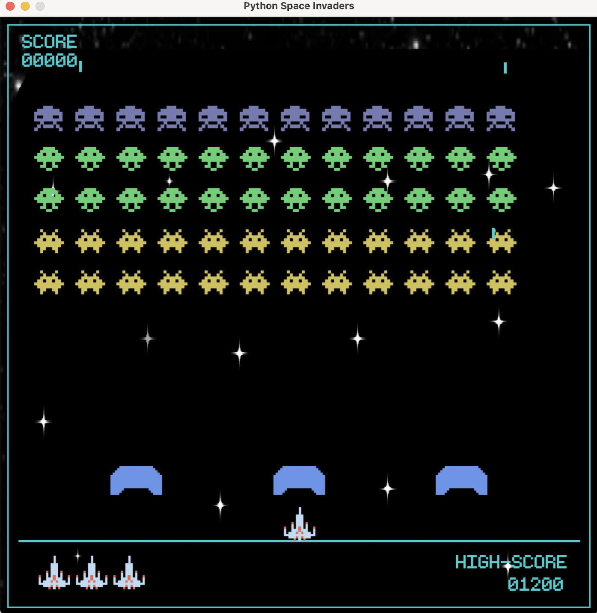

# Space Invaders
# 1. Mô tả
- Tên trò chơi: Space Invaders
- Trò chơi là một phiên bản tái tạo của trò chơi Space Invaders kinh điển. Người chơi sẽ điều khiển một tàu vũ trụ để tiêu diệt các hành tinh ngoài hành tinh đang xâm nhập. Trò chơi có một loạt các cấp độ khác nhau, với độ khó tăng dần và những thách thức mới.

# 2. Cài đặt
## 2.1 Yêu cầu
- Python 3.12
- Pygame
## 2.2 Cách cài đặt
1. Clone repository này hoặc tải xuống dưới dạng ZIP.
2. Cài đặt Python từ trang web chính thức: python.org.
3. Cài đặt Pygame bằng cách mở terminal và chạy lệnh sau:
```
pip install pygame
```
# 3. Cách chơi
- Chạy file main.py để bắt đầu trò chơi.
- Trong màn hình menu chính, nhấn nút "PLAY" để bắt đầu trò chơi.
- Sử dụng các phím mũi tên để di chuyển tàu vũ trụ của bạn và phím Space để bắn.
- Tiêu diệt tất cả hành tinh ngoài hành tinh để chiến thắng cấp độ.
- Trò chơi kết thúc khi tất cả các mạng của bạn bị mất hoặc bạn hoàn thành tất cả các cấp độ.


